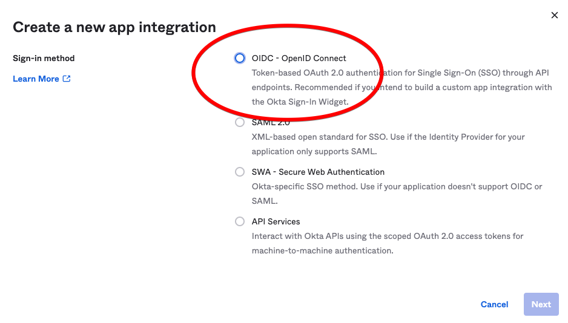
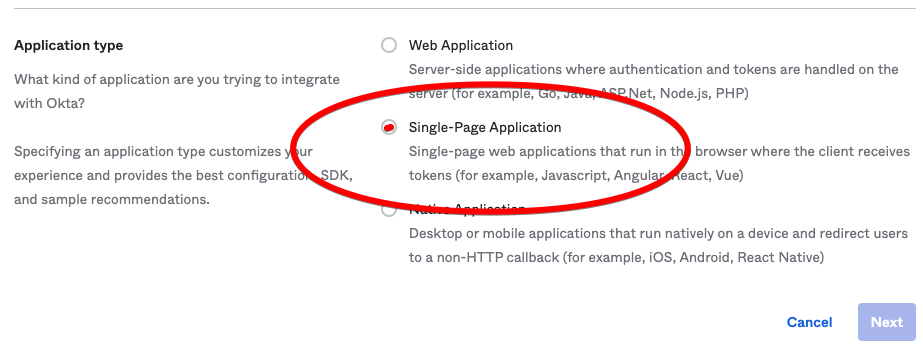
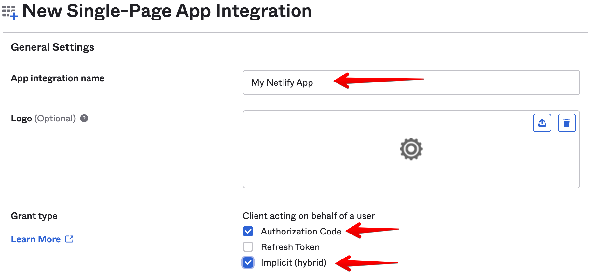
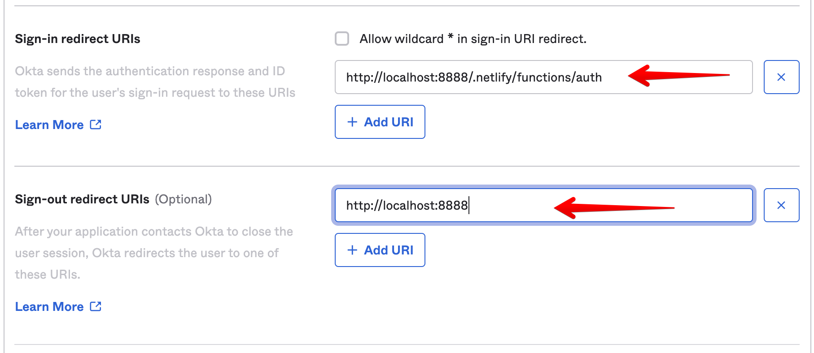
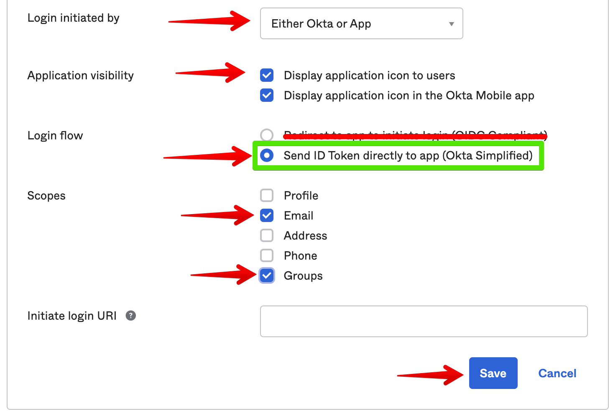
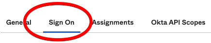
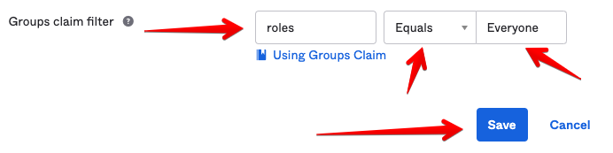
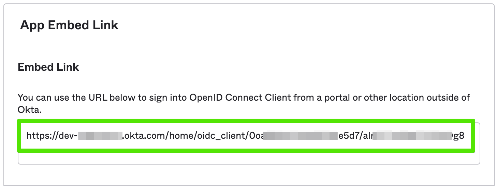

# netlify-okta-auth Installation

This installation guide will take you through installing the software into your website and getting things running in your local development environment.

After getting things running locally, you will want to follow our [production configuration guide](production.md) to get things set up in production.

## Prerequisites

### Netlify account

You can [sign up for Netlify here](https://app.netlify.com/signup). You will need to upgrade to a Pro account in order to have access control for your site.

### Okta account

If you have a single Okta account for your company, it is recommended that you also sign up for a free [developer account](https://developer.okta.com/signup/) when testing.

## Website setup

> If you don't have a website set up currently, you can simply create a test website by creating an empty directory and [saving this file](./examples/index.html) as `index.html` in the new directory. You can then proceed with this guide using that new directory with your single `index.html` file as the root of your website.

### Locate package.json

First, we need to install the `@twilio-labs/netlify-okta-auth` package using `npm` (or `yarn`), but we need to ensure we're in the right directory before we do.

Usually, this will be the root directory of your application and the rest of this guide will assume such.

> If you are already have your own Netlify functions, then you _may_ already have a `package.json` located in the directory with your functions.

If you don't already have a `package.json` file anywhere in your project, then you can create one with the following command:

```bash
npm init -y
```

> If you cannot run the `npm` command, you may need to [install Node.js](https://nodejs.org/en/download/) on your system.

### Install the package

From the directory where your `package.json` exists, run the following command:

```bash
npm install --save @twilio-labs/netlify-okta-auth
```

### Run your site with the Netlify CLI

If you haven't already installed it, install the [Netlify CLI](https://cli.netlify.com/) now following [their guide](https://docs.netlify.com/cli/get-started/).

Now, you want to use the CLI to run your local development environment:

```bash
netlify dev
```

> If you need help getting your local development running, refer to [Netlify's documentation](https://docs.netlify.com/cli/get-started/#run-a-local-development-environment).

Once the server is running, you should see:

```text
Server now ready on http://localhost:8888
```

> If you run your development server on a port other than `8888`, be sure to use that instead in the examples below.

### Create Netlify functions

If it doesn't already exist, create the folder `netlify/functions` in your project. On Mac and Linux, this would be:

```bash
mkdir -p netlify/functions
```

> If you already have your own Netlify functions, use your existing `functions` directory.

Create an `auth.js` file in the new `functions` directory and paste in the following:

```javascript
const { getAuthHandler } = require("@twilio-labs/netlify-okta-auth");

const config = {
  jwtSecret: "super_secret_dev_only_value",
  prodBaseUrl: "http://localhost:8888", // update this as necessary
  oktaUrl: "TODO", // we'll get this soon
};

exports.handler = getAuthHandler(config);
exports.config = config;
```

Next, create a `login.js` file in the same `functions` directory and paste in the following:

```javascript
const { getLoginHandler } = require("@twilio-labs/netlify-okta-auth");
const { config } = require("./auth");

exports.handler = getLoginHandler(config);
```

Now, when you run `netlify dev` you should see it load your two new functions:

```console
◈ Loaded function auth.
◈ Loaded function login.
```

Before we put the functions to work, however, we need to hop over to Okta and set up a new app.

## Okta for local dev setup

We will create a new application in Okta.

1. In the Okta Admin Console, go to **Applications > Applications**.
2. Click **Create App Integration**.
3. Choose **OIDC - OpenID Connect** as the **Sign-in method**.
   
4. Choose **Single-Page Application** as the **Application type**.
   
   > Even if you aren't deploying a true Single-Page Application (SPA), we still want to choose this option as we need a client-side token.
5. Click **Next**.
6. Name your application and optionally choose a logo image for it.
7. For **Grant type**, ensure **Authorization Code** and **Implicit (hybrid)** are checked.
   
8. Enter `http://localhost:8888/.netlify/functions/auth` under **Sign-in redirect URI**.
9. Enter `http://localhost:8888` under **Sign-out redirect URIs**
   
10. Leave **Trusted Origins** empty.
11. Under **Assignments** > **Controlled access** choose whichever option you prefer. For testing on a developer account, **Allow everyone in your organization to access** works fine.
12. Click **Save**. We aren't quite done yet, just a few more things to adjust...
13. Click **Edit** next to **General Settings**.
14. UN-check **Require consent** under **User consent**.
15. Scroll down to the **LOGIN** section and set the following options:

    - **Login initiated by**: **Either Okta or App**
    - **Application visibility**: Your preference, but it's helpful to at least check **Display application icon to users**.
    - **Login flow**: **Send ID Token directly to app (Okta Simplified)** IMPORTANT!
    - **Scopes**: Check **Email** and **Groups**.

    

16. Now, go to the **Sign On** tab.
    
17. Click the **Edit** button in the **OpenID Connect ID Token** section.
18. Change the **Groups claim filter** to **roles**, **Equals**, **Everyone**.
    
19. Click **Save**.
20. Go back to the **General** tab and scroll down to the **App Embed Link** section.
    
21. You will need to save this URL as we'll need it in the next step.

## Finishing the setup and testing locally

Now that you have that URL from your new Okta application, we need to add it to your configuration.

### Update `oktaUrl` configuration setting

Open the `auth.js` function and paste in your Okta URL for the `oktaUrl` configuration key. Your `auth.js` may end up looking something like this:

```javascript
const { getAuthHandler } = require("@twilio-labs/netlify-okta-auth");

const config = {
  jwtSecret: "super_secret_dev_only_value",
  prodBaseUrl: "http://localhost:8888",
  oktaUrl: "https://dev-nnnn.okta.com/home/oidc_client/abcdef1234",
};

exports.handler = getAuthHandler(config);
exports.config = config;
```

Just a few more configuration items and we'll be ready to go!

### Set up `_redirects` file

In the root of your project, create (or edit, if it already exists) the `_redirects` text file and add the following lines at the top:

```text
# To use the site you must be logged in (e.g. Role=Everyone)
/*	200!	Role=Everyone

# Allow these assets when not logged in (good for browser bookmarks)
/site.webmanifest      /site.webmanifest       200!
/apple-touch-icon.png  /apple-touch-icon.png   200!
/favicon*              /favicon:splat          200!
/android-chrome-*      /android-chrome-:splat  200!

# Fallback login function if not logged in
/*  /.netlify/functions/login  200!
```

This configuration will enforce authentication for all routes on your site (with some exceptions listed after). The final line will redirect the user to our new `login` function to get them authenticated.

### Tell Netlify CLI what JWT secret to use in dev

Finally, we need to configure `netlify dev` to use the same JWT secret we configured in the function above. Create (or open if it already exists) the `netlify.toml` file in the root directory. Add these lines to the file and save it:

```toml
[dev]
  jwtSecret = "super_secret_dev_only_value"
```

> You can find a repository with all of this configuration setup [here](https://github.com/twilio-labs/netlify-okta-auth-sample-site).

### Time to test

Now, let's fire up the dev server:

```bash
netlify dev
```

Immediately, when your browser tries to load the home page of your site, it will redirect you to your development Okta login page (you might not notice this if you're already logged in). Once you are logged in, you will be taken back to the home page.

You've done it!

## What's next?

Now that you have everything running locally, the next step is to [configure production](production.md).
